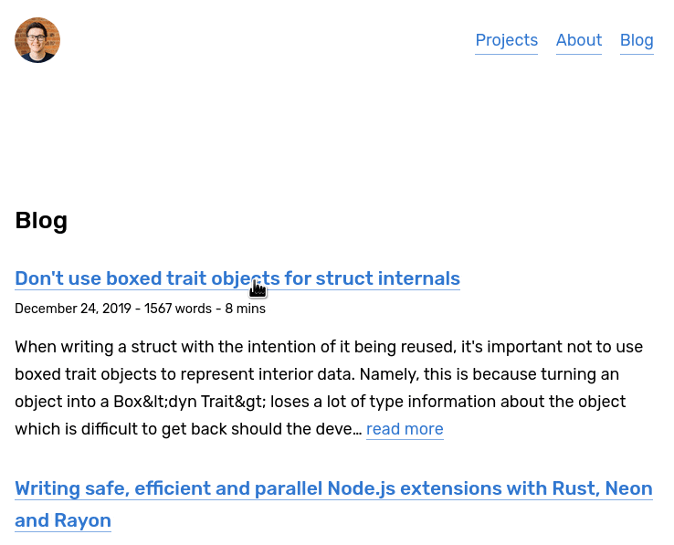

+++
title = "Creating a blazing fast static website without Gatsby or JavaScript"
description = "TODO"
draft = true
[taxonomies]
tags = ["rust","webdev","beginner"]
+++

Gatsby, React and static websites seem to be all the rage at the moment, and for the most part I've been on the bandwagon.

For [over a year](https://github.com/gatsbyjs/gatsby/pull/12693) I've been working daily helping maintain a large Gatsby site,
working on a Gatsby personal site and enjoying flexing my [Gatsby merch](https://store.gatsbyjs.org/).
But after reading an excellent article by Tom MacWright, [Second-guessing the modern web](https://macwright.org/2020/05/10/spa-fatigue.html), I too started to think that maybe life should be simpler.

## JavaScript costs seconds

Blazing fast websites have a lot of logic that tries to make them fast.
They have routines for fetching data, pre-fetching data, caching data and rendering data, all in the hopes of delivering the fastest most seamless experience possible.

However,

### Prerender your pages without JavaScript

One of the benefits of React apps is instant navigation.
Not having to load a new web page means you can seamlessly navigate throughout the app without the user having the jarring experience of a page load.

If everything goes right, you'd expect something like this:


How did I achieve this?
Was it some script I added that fetches a `data.json` file on hover, pre-hydrating a page with React?
Did I load the page in an iframe and swap them over on link click?
Maybe I created a [portal](https://web.dev/hands-on-portals/) and sucked you through?

Nope!

I simply added the following tag to the head for each of the links on my page:

```html
<link rel="prerender" href="<page url>" />
```

It works like a charm, and it's been supported in all the big browsers for a [very very long time](https://caniuse.com/#feat=link-rel-prerender).

For context, here's what the page looks like without the tags:



It's still pretty good! But definitely not the buttery-smooth experience you'd expect from a modern website.

## No service worker, no worries

Something that pained

## What do you lose when you leave?

Unfortunately it's not all rainbows when you curb JavaScript from your personal site.
In fact, by banning JavaScript you throw away the opportunity to have an interactive experience on your page.

Some of my greatest web experiences have been on dynamic pages.
A few examples that come to mind are [Where can North Korea's missles reach?](https://www.abc.net.au/news/2017-10-16/north-korea-missile-range-map/8880894?nw=0) and [Build your own React](https://pomb.us/build-your-own-react/).
The technique that they use is called [scrollytelling](https://pudding.cool/process/how-to-implement-scrollytelling/) and I absolutely love it.

It's not all bad news though.
While I might think that overly complicated JavaScript powered static sites are evil I have nothing against JavaScript in general.
Feel free to spruce up your pages with JavaScript - just use it when you have to.

## Conclusion

- Javascript is expensive. Time spent downloading, parsing and evaluating the code can add seconds to interactivity
- Browsers have built in support for pre-fetching pages which can be used to speed up navigation

