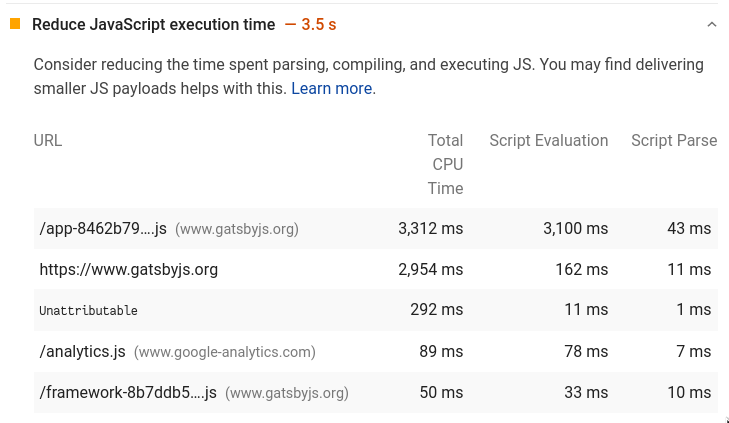
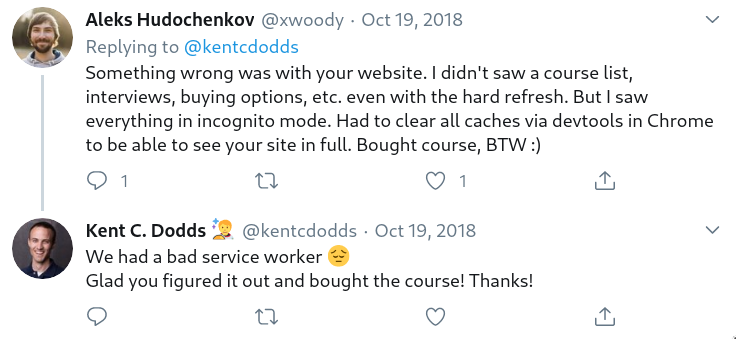
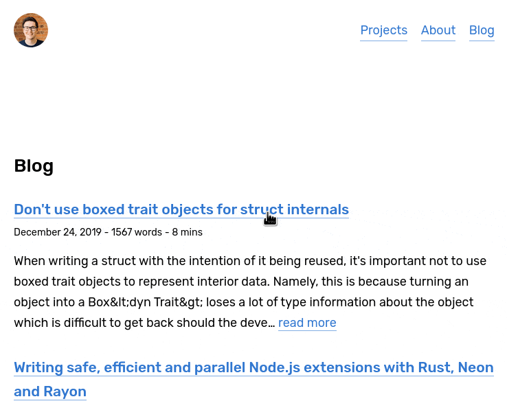

+++
title = "Creating a blazing fast static website without Gatsby or JavaScript"
description = "How to create a blazing fast static website without Gatsby or JavaScript that meets all the Core Web Vitals"
draft = true
[taxonomies]
tags = ["webdev","beginner"]
[extra]
thumbnail = "og-image.png"
+++

Gatsby, React, and static websites are all rage at the moment. Though they aren't without their flaws, for the most part, I've been riding the bandwagon.

[Over the last year](https://github.com/gatsbyjs/gatsby/pull/12693) I've been working daily helping maintain a large Gatsby site,
working on a Gatsby personal site and enjoying flexing my [Gatsby merch](https://store.gatsbyjs.org/).
But after reading [Second-guessing the modern web](https://macwright.org/2020/05/10/spa-fatigue.html), the advent of the [Core Web Vitals](https://web.dev/vitals/), and a general obsession with everything Rust,
I've too started to think that maybe life should be simpler.

## JavaScript costs seconds

Blazing fast websites have a lot of logic that tries to make them fast.
They have routines for fetching data, pre-fetching data, caching data, rendering data, hydrating and bootstrapping pages - all in the hopes of delivering the fastest, most seamless experience possible.
This, however, comes at the cost of having to deliver and parse large amounts of JavaScript on the client.

To see just how significant a role JS plays, try using Google's [PageSpeed Insights](https://developers.google.com/speed/docs/insights/v5/about) on any of your favourite websites.

Here's how the [Gatsby home page](https://gatsbyjs.org) fairs:


([Full test results](https://developers.google.com/speed/pagespeed/insights/?url=https%3A%2F%2Fwww.gatsbyjs.org%2F))

That's crazy! The CPU spends just over 3 seconds parsing and evaluating the entry bundle.

### SEO Implications

Google is currently pushing the [Core Web Vitals](https://web.dev/vitals/#core-web-vitals) - a set of metrics that analyse the page load performance of your site.

On the search front, these metrics will contribute to your [SEO ranking](https://www.searchenginejournal.com/googles-core-web-vitals-ranking-signal/370719/).
Although the direct impact of a low score is not yet known, JavaScript is generally detrimental and limiting your usage can only do good.

## No service worker, no worries

The idea of progressive web apps (or PWAs) excites many, and in theory they sound great!
But there are a few caveats that might catch up to you when you least expect it.

### Bad service workers

Since service workers live in the user's browser, if you ever deliver a service worker that doesn't have any logic for updating itself when there's a new version, your users will be stuck with that version forever! A classic example is [this tweet](https://twitter.com/kentcdodds/status/1053241715153227777) by Kent C. Dodds.



Despite hard-refreshing the page a bad service worker almost ruined everything for Aleks. He had to manually open the developer tools and flush the cache - something most users wouldn't - or couldn't - do.

Even if you don't have a bad service worker, they still linger well after you've removed them.

If you're using Gatsby and you've ever installed `gatsby-plugin-offline` you have to do more than just disabling the plugin to remove it.
In reality, you need to add yet another plugin! Namely, this is done using [`gatsby-plugin-remove-serviceworker`](https://www.npmjs.com/package/gatsby-plugin-remove-serviceworker), which unregisters the old service worker for you when users visit your site.
But be warned, if you're ever planning on moving away from Gatsby, you'd better hope all your users reach your site in time to have their service worker removed!

## Gatsby speed with static sites

So how do you build a speedy site without JavaScript? Here are a few tips that I used to build this site with the Rust powered static site generator - [Zola](https://www.getzola.org/).

### Prerender your pages

One of the benefits of React and Gatsby pages is instant navigation.

Not having to load a new web page means you can seamlessly navigate throughout the app without the user having the jarring experience of a page load.

If everything goes right, you'd expect something like this:



How did I achieve this?
Was it some script I added that fetches a `data.json` file on hover, pre-hydrating a page with React?
Did I load the page in an iframe and swap them over on link click?
Maybe I created a [portal](https://web.dev/hands-on-portals/) and sucked you through?

Nope!

I just added the following tag to the head for each of the links on my page:

```html
<link rel="prerender" href="<page url>" />
```

It works like a charm, and all the big browsers have supported it for a [very very long time](https://caniuse.com/#feat=link-rel-prerender).

For context, here's what the page looks like without the tags:


It's still pretty good! But not the buttery-smooth experience you'd expect from a modern website.

### Inline styles

When you inline styles in the head of your website you save another request to the server.
While it sounds insignificant, chained requests can often have a significant impact on your site and are taken into consideration when Google's PageSpeed algorithm evaluates your page.

This technique is employed Gatsby when you use a CSS-in-JS option like `styled-components`, Google's [AMP](https://amp.dev/) and is possible with many static site generators.

Unfortunately, with Zola you can't currently inline compiled SASS - that's why I created the [static-site-optimizer](https://github.com/bennetthardwick/static-site-optimizer) tool to inline styles and generate AMP pages.

### Self-host your fonts

Many people default to using a font provider like [Google Fonts](https://fonts.google.com/) when building a site.
While it has the benefit of the browser possibly having cached the fonts before, it's often more practical to host the fonts yourself.

Like styles, it comes down to the fact that using a third-party provider causes many chained requests - each having a certain amount of latency. With most of the world having strong internet connections, downloading a tiny woff2 font file is negligible compared to latency from multiple round trips. For more information, read [Should you self-host Google Fonts?](https://www.tunetheweb.com/blog/should-you-self-host-google-fonts/).

### Serve your data well

If you're not using a CDN already, you definitely should be.
[Netlify](https://www.netlify.com/) provides free hosting and a free CDN and, at the time of writing, I'm using it to host this site and a few others.
If you don't want to use Netlify, Cloudflare offers a free CDN, but I've found the latency introduced by Cloudflare proxying your site often outweighs it's benefits - unless you're aggressively caching everything.

On the topic of caching, to increase performance and decrease cost, it's essential to cache your images for as long as possible.
If you're using something like Gatsby's `gatsby-image` that generate images where the filename is unique to that image, you can effectively cache files indefinitely since there should never really be a collision.

## What do you lose when you leave?

Unfortunately, it's not all rainbows when you curb JavaScript from your site.
In fact, by banning JavaScript you throw away the opportunity to have an interactive experience on your page.

Some of my greatest web experiences have been on dynamic pages.
A few examples that come to mind are [Where can North Korea's missles reach?](https://www.abc.net.au/news/2017-10-16/north-korea-missile-range-map/8880894?nw=0) and [Build your own React](https://pomb.us/build-your-own-react/).
The technique that they use is called [scrollytelling](https://pudding.cool/process/how-to-implement-scrollytelling/), and I absolutely love it.

It's not all bad news though.
While I might think that overly complicated JavaScript-powered static sites are evil I have nothing against JavaScript in general.
Feel free to spruce up your pages with JavaScript - just use it when you have to.

## Conclusion

- JavaScript is expensive.
  Time spent downloading, parsing and evaluating code can make users wait seconds before interacting with your page.
- SPAs are great because they feel super responsive,
  but browsers have built-in support for pre-fetching pages which can be used to speed up navigation to be almost instant
- Removing the number of chained requests is very important to speed up your site.
  You can do this by inlining styles and hosting your own fonts.
- Getting rid of JavaScript makes it harder to craft interactive experiences on the web.

If you're interested in building your own static website, I've implemented a bunch of the tips I've mentioned in my [Simple Dev Blog](https://github.com/bennetthardwick/simple-dev-blog-zola-starter) Zola starter.
